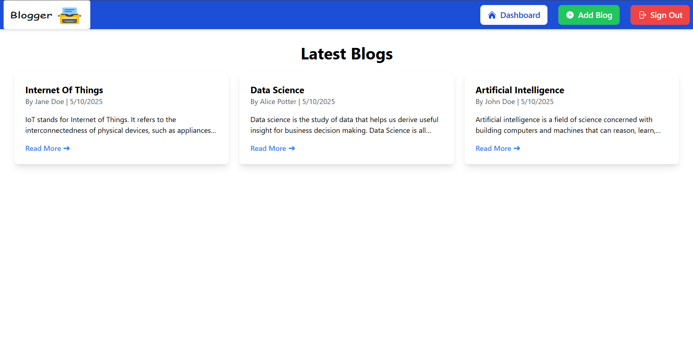

# Welcome to Blogger (A Simple, Intuitive, Minimalistic Blogging App)

### The site is hosted online. Click [here](https://blogger-frontend-uy5o.onrender.com) to visit it.

### Screenshot:

## Description

This is a very basic full stack web application built using the MERN stack.  
This app was built to learn the working of web, texh stacks, their use and handling the web development part.

## The technologies used are:

-   **Frontend**: React JS, Tailwind CSS, HeroIcons.
-   **Backend**: Node JS, Express JS, Mongoose, JWT (For Authentication).
-   **Database**: MongoDB Atlas (For web hosting).
-   **Hosting**: Render.
